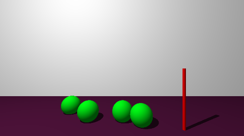
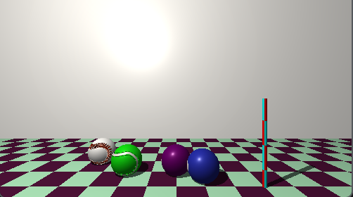

*This project has been created as part of the 42 curriculum by tpanou-d*
# miniRT
 

## Description
**miniRT** is a simple 3D graphical engine that serves as an introduction to the world of ray tracing. Through a set of mathematical computations, it simulates the path of light rays in the given 3D environment which allows for more realistic rendering that what would be typically expected from a regular rasterization engine.

miniRT is able to render :

- **Planes**
- **Spheres**
- **Cylinders**
- One white **spotlight** and its diffuse lighting
- Colored **ambient lighting**

The engine also has a bonus version which is capable of :

- Rendering **cones**
- Having multiple colored **spotlights**
- Showing **specular reflections**
- Handling **textures** and **bump maps**
- **Anti-aliasing**


## Instructions

### Dependencies

- A Unix-like system (Linux or macOS)
- `make`, `gcc`/`cc`, and `git`
- [MiniLibX](https://github.com/42Paris/minilibx-linux) (or the macOS
  equivalent) and its dependencies (used only for opening a window and displaying the rendered pixel buffer)

### Compilation

To compile miniRT, do :

```bash
make
```

This will produce an executable named `miniRT` at the root of the project.

### Execution

```bash
./miniRT <scene_file.rt>
```

Where `<scene_file.rt>` is a text file describing the camera, lights, and
objects in the scene (see the `scenes/` folder for examples).

**Controls once the window is open:**

| Key / Action        | Effect                     |
|----------------------|----------------------------|
| `ESC` / close button | Quit the program           |

### Parsing

The parsing of the `<scene_file.rt>` file must be a list of all the elements present in the scenes, all separacted by one or more `\n`.

An example :

```
A 0.3    255,255,255
C 0,20,-10   0,0,1   100

L -50,100,0  0.7    255,250,240

pl 0,0,100   0,0,1   255,255,255
pl 0,-10,0   0,1,0   80,20,60

sp -35,-5,60  12   0,255,22 
sp -20,-5,50  12   0,255,22 

sp 0,-5,50      12    0,255,22 
sp 10,-5,45  12   0,255,22  

cy 30,0,40         0,-1,0  1.5 40   255,0,0
```

This will render the following:



All the available objects for a `.rt` scene are :

- **Ambient Lighting**
```
In the example: A 0.3 255,255,255

->	Declaration (<field>[range_min;range_max]):
	A <intensity>[0.0;1.0] <color>[0;255]
```
- **Spotlight**
```
L -50,100,0  0.7    255,250,240

->	L <origin>[-∞;∞] <intensity>[0.0;1.0] <color>[0;255]
```
- **Camera**
```
C 0,20,-10   0,0,1   100

->	C <origin>[-∞;∞] <normal_vector>[0.0;1.0] <horizontal_fov>[0;180]
```
- **Plane**
```
pl 0,0,100   0,0,1   255,255,255

->	pl <origin>[-∞;∞] <normal_vector>[0.0;1.0] <color>[0;255]
```
- **Sphere**
```
sp -35,-5,60  12   0,255,22
->	sp <origin>[-∞;∞] <diameter>[0.0;∞] <color>[0;255]
```
- **Cylinder**
```
cy 30,0,40         0,-1,0  1.5 40   255,0,0

->	cy <origin>[-∞;∞] <normal_vector>[0.0;1.0] <diameter>[0.0;∞] <height>[0.0;∞] <color>[0;255]
```

**NOTE :** **Ambient Lighting** (A), **Spotlight** (L) and **Camera** (C) can only be declared **once**. **Spotlight** (L) color will be ignored (it is only present for regular/bonus compatibility).

## Bonus

**miniRT** also comes with a bonus version with additional functionalities explained prior. To compile the bonus version, do :


```bash
make bonus
```

This will replace/create the `miniRT` executable at the root of the project. It use used the same way has the regular executable :

```bash
./miniRT <scene_file.rt>
```

### Parsing

The bonus parsing adds  :

- The **cone** object
```
co <origin>[-∞;∞] <normal_vector>[0.0;1.0] <angle>[0;180] <height>[0.0;∞] <color>[0;255]
```
- The ability to declare as many **Spotlights** (L) as desired
and have the `color` attribute actually work

- Rendering options

Rendering options must be declared at the end of the object. They are written as follows `opt1:val;opt2:val...`. Given that they are options, they do not necessarily have to be declared, and only desired options can be stated. If an option isn't manually set, it will be assigned a default value.

The options available are :

- For **Camera** : Anti-aliasing, skybox and custom resolution

```
- aa:<anti-aliasing level>[0;5] -> default 0
- sky:</path/to/skybox_texture.xpm> -> default none
- res:<WIN_X, WIN_Y>[0;2000] -> default 1280x720

E.g. : C 0,0,0 (...)  aa:3;sky:skybox.xpm;res:1920,1080 
       C 0,0,0 (...)  res:500,500;aa:5
```

- For **any shapes** : Check-board pattern, texture and bump map

```
- check:<number of squares>[0;100] -> default 0
- txt:</path/to/texture.xpm> -> default none
- bump:<WIN_X, WIN_Y>[0;2000] -> default none

E.g. :  (...)  check:10;txt:txt.xpm;bump:bump.xpm 
```

> [!NOTE]
> For **Plane**, `check:<numbers of squares>[0;100]` becomes ```check:<squares size>[0.0;∞]```, representing the size of the squares with respect to the unit vector and not the number of squares. The bump/textures applied to **Plane** will be mapped on its checkboard pattern.

### Example

The following `.rt` scene :

```
A 0.3    255,255,255
C 0,20,-10   0,0,1   100 res:1920,1080

L -50,100,0  0.7    255,250,240

pl 0,0,100   0,0,1   255,255,255
pl 0,-10,0   0,1,0   80,20,60 check:10

sp -35,-5,60  12   0,255,22 txt:imgs/SoftballColor.xpm;bump:imgs/SoftballBump.xpm
sp -20,-5,50  12   0,255,22 txt:imgs/NewTennisBallColor.xpm;bump:imgs/TennisBallBump.xpm

sp 0,-5,50      12    0,255,22 txt:imgs/Ball4.xpm
sp 10,-5,45  12   0,255,22  txt:imgs/Ball2.xpm

cy 30,0,40         0,-1,0  1.5 40   255,0,0   check:5
```

Should render this :



## Resources

Classic references used to understand the theory and techniques behind the
project:

- [Raytracing](https://en.wikipedia.org/wiki/Ray_tracing_(graphics)) — wikipedia, of course.
- [Scratchapixel](https://www.scratchapixel.com/) — in-depth articles on
  ray-object intersection math (spheres, planes, cylinders), UV mapping, and
  coordinate systems.
- [Cosinekitty](http://cosinekitty.com/raytrace/raytrace_us.pdf) — The book Fundamentals of Ray Tracing

### AI usage

AI was used as a **debugging and code-review assistant**. It was not used
 to generate the project from scratch.

All architectural decisions, mathematical thinking, overall code structure, parsing
grammar, and final implementations were written and verified by the
author. AI-suggested fixes were reviewed, tested against sample scenes,
and adapted before being committed.


